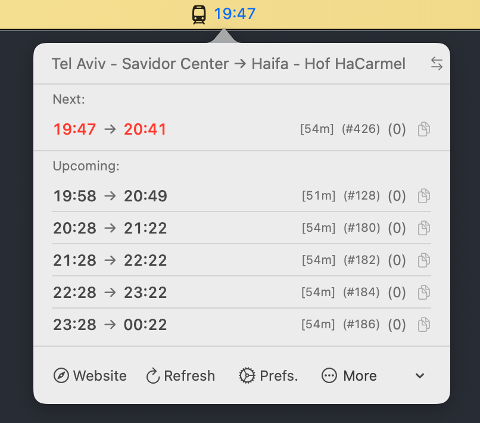
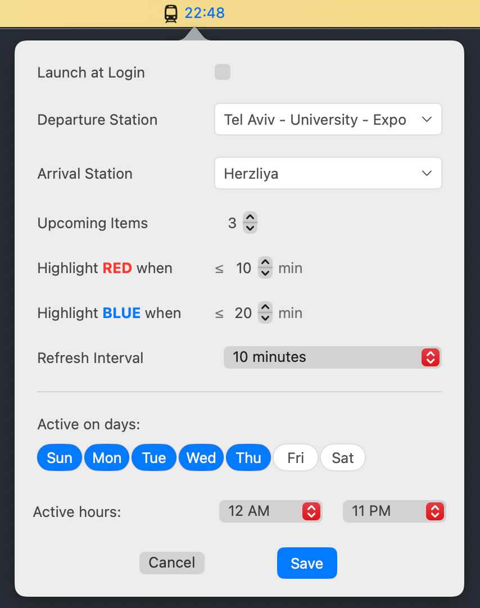

# ILrail-bar


[](https://www.buymeacoffee.com/drehelis)

<p align="center">
  
</p>


A sleek and efficient macOS menu bar app for tracking Israel Railways train schedules in real-time.

## Features

- **Menu Bar Integration**: Live train information right in your macOS menu bar
- **Quick Access**: See upcoming trains at a glance in a popover interface
- **Customization**: Set preferred departure & destination stations 

## Screenshots

<p align="center">
  
  
</p>

## Installation

### Option 1: Direct Download

1. Download the latest release from the [Releases](https://github.com/drehelis/ILrail-bar/releases) page
2. Open the DMG file **(Read README.txt!)** and drag ILrail-bar to your Applications folder
3. Launch the app from your Applications folder

### Option 2: Build from Source

1. Clone this repository:
   ```bash
   git clone https://github.com/drehelis/ILrail-bar.git
   ```
2. Open the project in Xcode
3. Build and run the application (⌘+R)

Alternatively, you can build from the command line:
   ```bash
   cd ILrail-bar
   xcodebuild -project ILrail-bar.xcodeproj -configuration Debug
   open build/Debug/ILrail-bar.app
   ```
To pack DMG file, use `./utils/package_dmg.sh`

## Usage

1. **Initial Setup**: When you first launch the app, it will appear in your menu bar with a train icon
2. **View Trains**: Click the icon to open a popover with upcoming train information
3. **Preferences**: Click the "Preferences" button in the popover to configure your stations, refresh interval, and alerts
4. **Quick Actions**: 
   - Use the "Reverse Direction" button (↔) to swap departure and arrival stations
   - Click on a train listing to copy its details to your clipboard

## Privacy

ILrail-bar uses the official Israel Railways API and does not collect or store any personal data. All requests are made directly from your device to the official Israel Railways endpoint.

## Feedback and Contributions

Feedback and contributions are welcome! Please feel free to:
- [Open an issue](https://github.com/drehelis/ILrail-bar/issues) for bug reports or feature requests
- [Submit a pull request](https://github.com/drehelis/ILrail-bar/pulls) for bug fixes or new features

## License

This project is licensed under the MIT License - see the [LICENSE](LICENSE) file for details.
